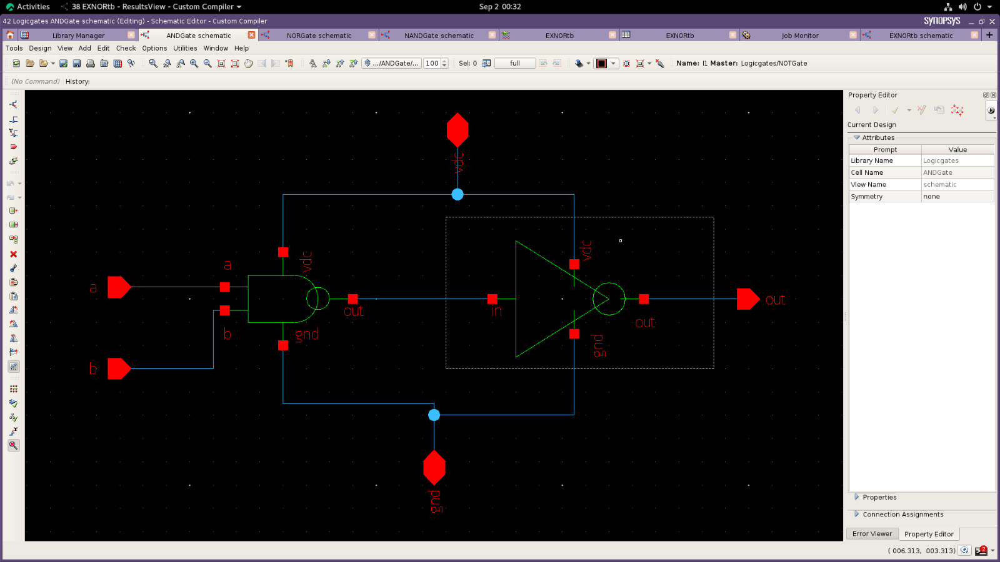
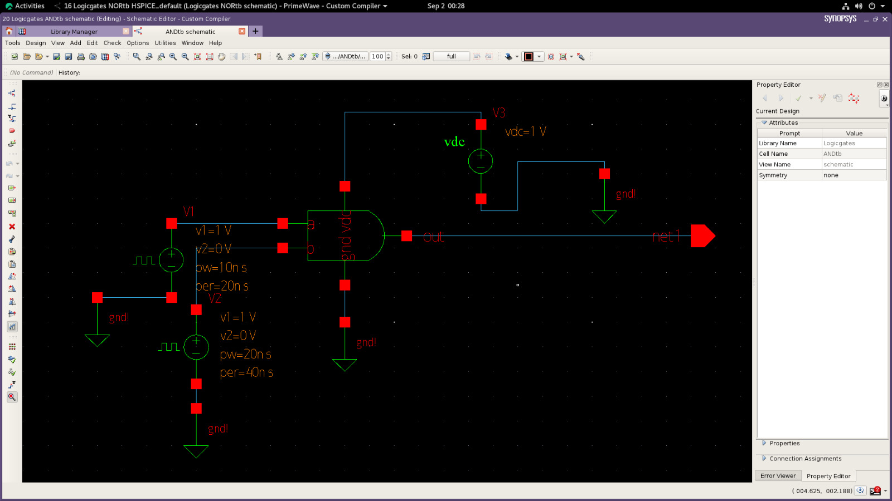
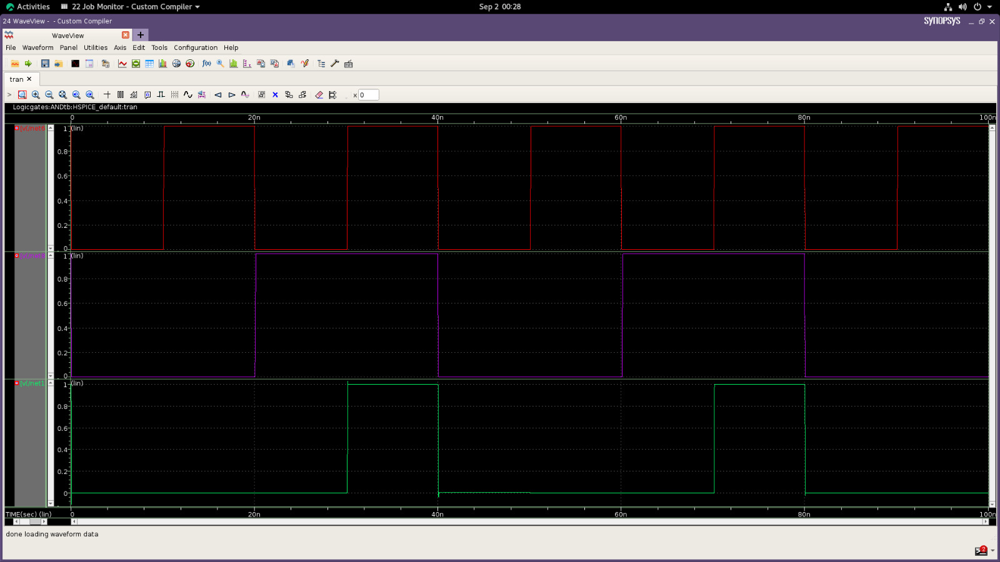

# AND Gate Design using Synopsys

This project demonstrates the design and simulation of an AND Gate using Synopsys tools.

## Tools Used

* Synopsys

## Project Contents

* AND Schematic
* AND Symbol
* Simulation waveform

## Output Images

### AND Schematic

## AND Symbol

### Waveform

