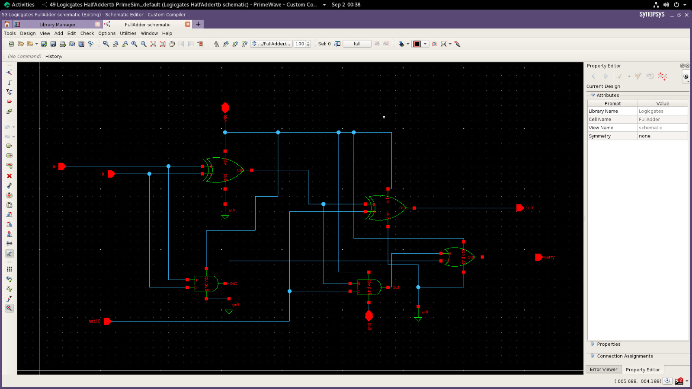
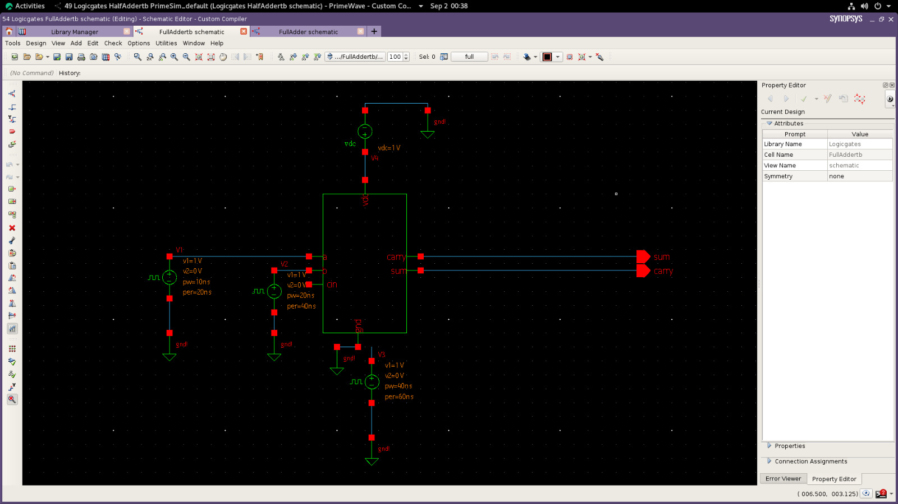
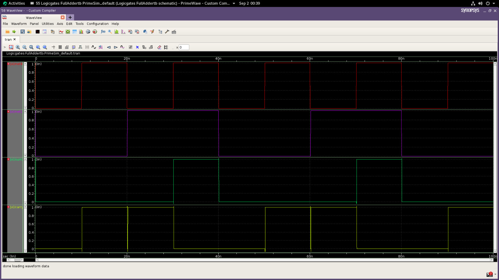

# Full Adder Design using Synopsys

This project demonstrates the design and simulation of a Full Adder using Synopsys tools.

## Tools Used

* Synopsys

## Project Contents

* Full Adder schematic
* Full Adder symbol
* Simulation waveform

## Output Images

### Full Adder Schematic

### Full Adder Symbol

### Waveform

