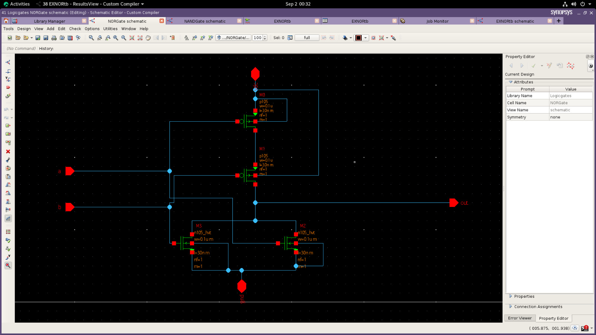
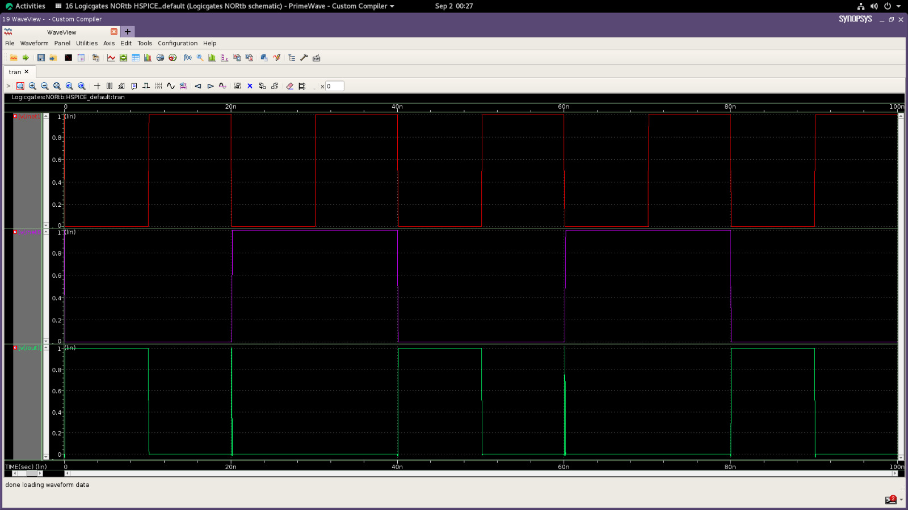
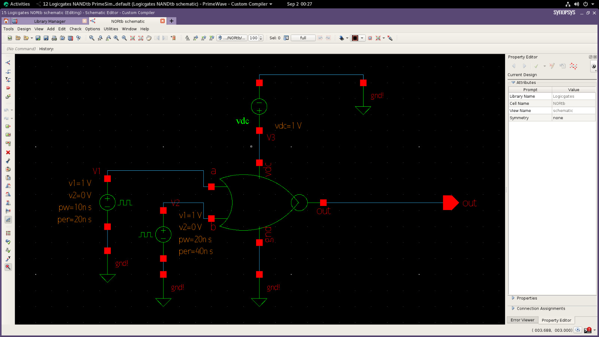

# NOR Gate Design using Synopsys

This project demonstrates the design and simulation of a NOR Gate using Synopsys tools.

## Tools Used

* Synopsys

## Project Contents

* NOR Gate
* Simulation waveform
* Symbol

## Output Images

### NOR Gate

### Waveform

### NOR Symbol

