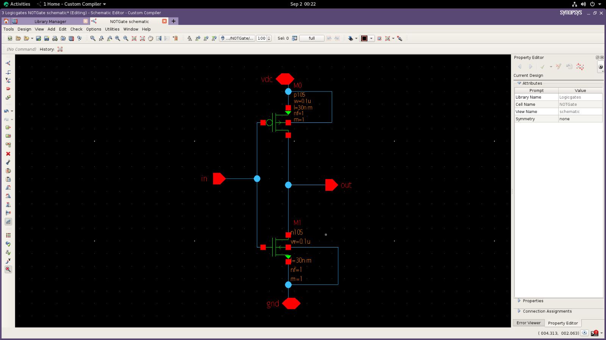
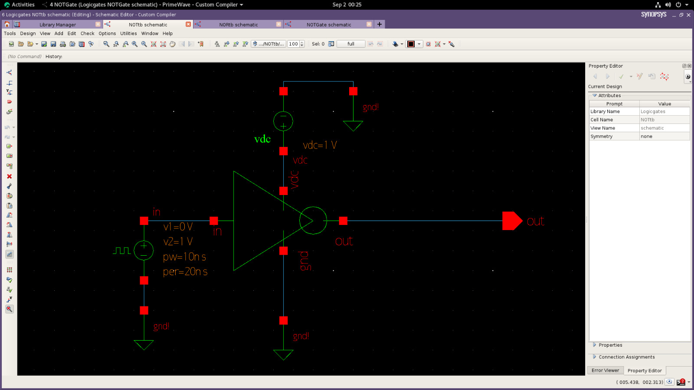
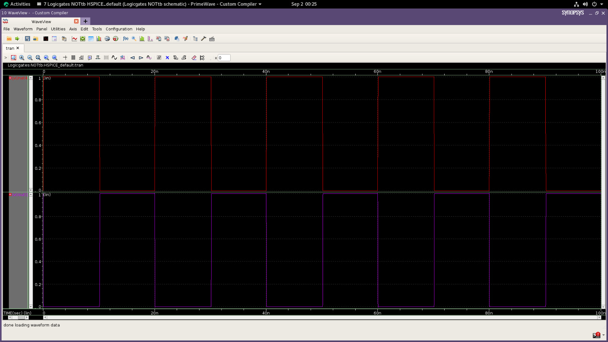

# CMOS NOT Gate Design using Synopsys

This project demonstrates the design and simulation of a CMOS NOT gate using Synopsys tools.

---

# Tools Used

* Synopsys Custom Compiler
* Synopsys PrimeWave

---

# Project Contents

* CMOS NOT gate schematic
* Symbol design
* Simulation waveform
* Testbench configuration

---

# Testbench Configuration

The testbench for the CMOS NOT gate design uses a VPULSE voltage source to provide the input signal. This pulse voltage toggles between 0 V (logic LOW) and 1 V (logic HIGH) to simulate realistic digital input levels.

## Key Parameters of VPULSE

* V1 (Initial Voltage): 0 V
* V2 (Pulsed Voltage): 1 V
* Period: 20 ns
* Rise Time: 1 ns
* Fall Time: 1 ns
* Pulse Width: 10 ns

The ground (0 V) reference is connected to the NMOS transistor source and system ground, while a VDC supply of 1 V powers the PMOS transistor source terminal, matching the logic voltage level.

This setup accurately verifies the inverter operation of the CMOS NOT gate.

---

# Output Verification

The simulation waveform confirms correct NOT gate behavior:

* When the input is HIGH (1 V), the output becomes LOW (0 V)
* When the input is LOW (0 V), the output becomes HIGH (1 V)

Thus, the CMOS inverter performs proper logic inversion.

---

# Output Images

## Schematic

---

## Symbol

---

## Waveform

---

