# Digital Design Projects using Synopsys

This repository contains various digital logic design and simulation projects developed using Synopsys tools.

The projects include:

* Logic Gates
* Adders
* Schematics
* Symbols
* Simulation Waveforms

---

# Tools Used

* Synopsys

---

# Implemented Projects

* NOT Gate
* AND Gate
* OR Gate
* NAND Gate
* NOR Gate
* EXOR Gate
* EXNOR Gate
* Half Adder
* Full Adder

---

# Output Images

# NOT Gate

## Schematic

## Symbol

## Waveform

---

# AND Gate

## Schematic

## Symbol

## Waveform

---

# OR Gate

## Schematic

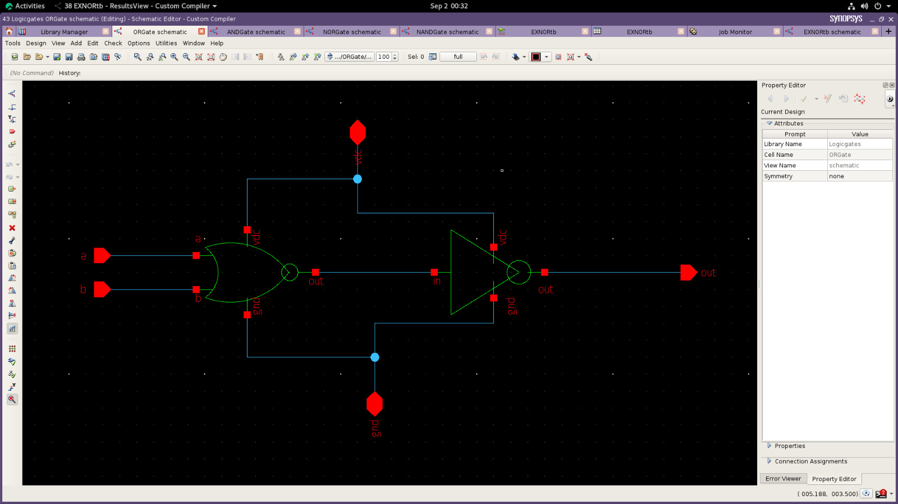

## Symbol

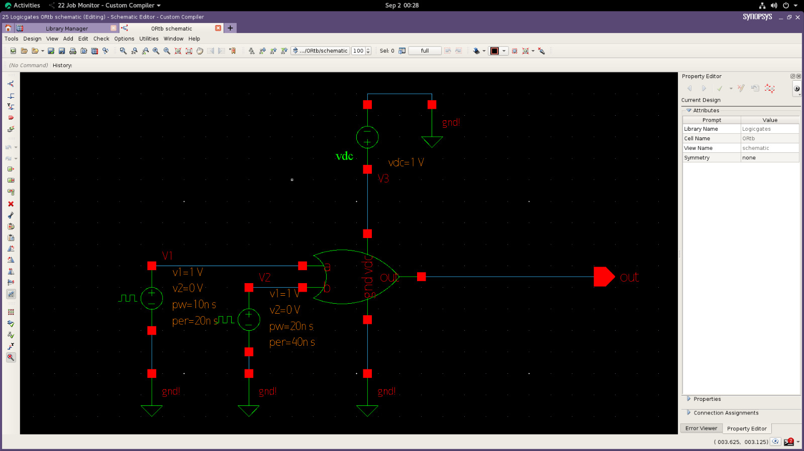

## Waveform

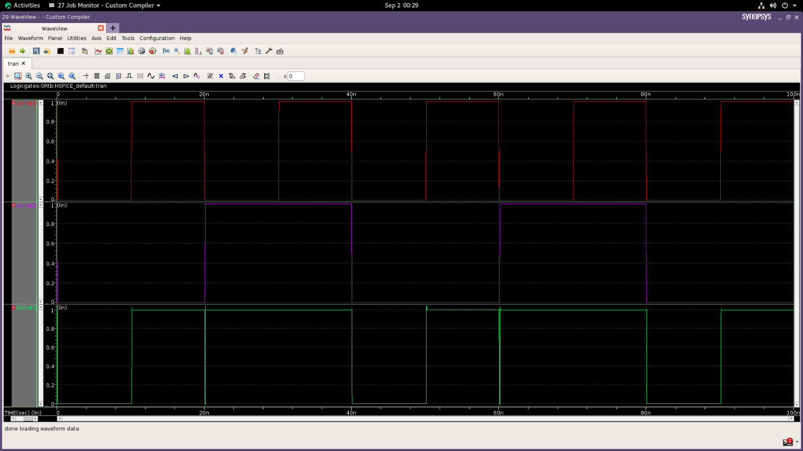

---

# NAND Gate

## Schematic

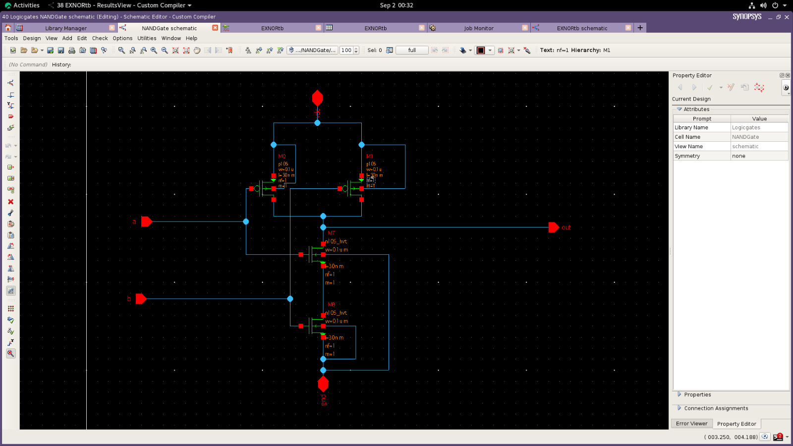

## Symbol

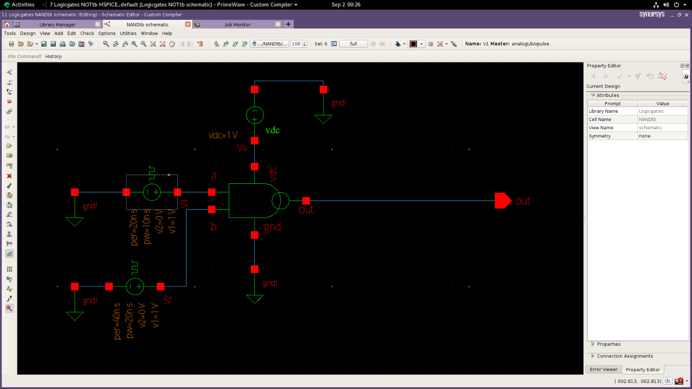

## Waveform

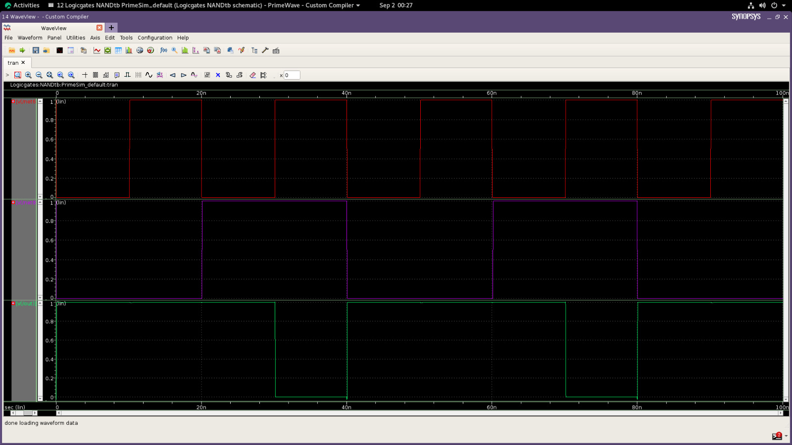

---

# NOR Gate

## Schematic

## Symbol

## Waveform

---

# EXOR Gate

## Schematic

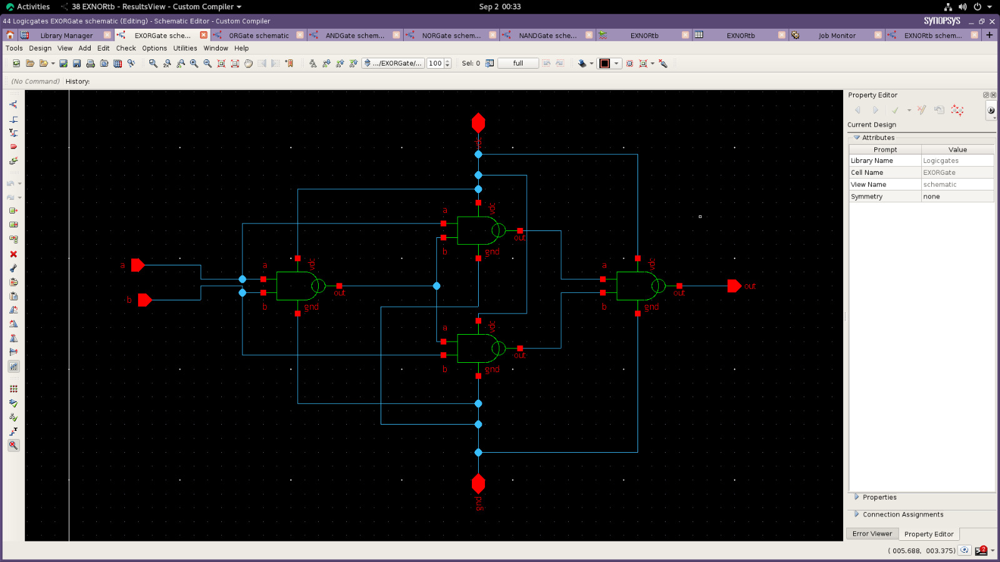

## Symbol

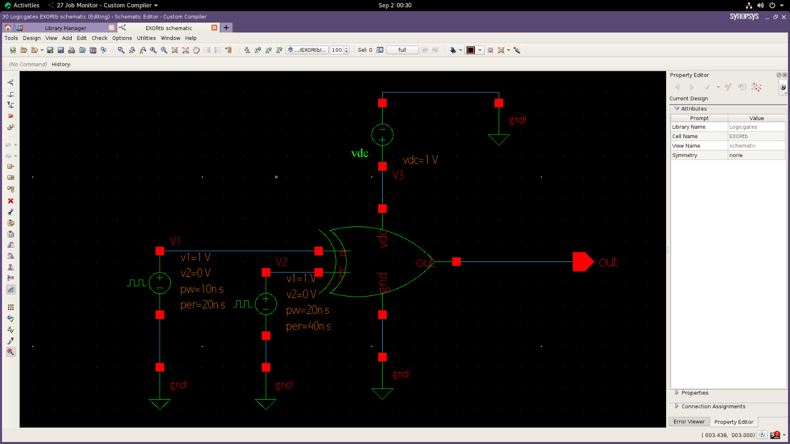

## Waveform

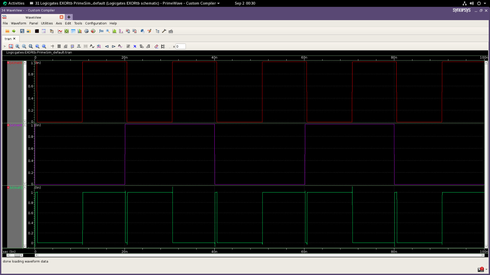

---

# EXNOR Gate

## Schematic

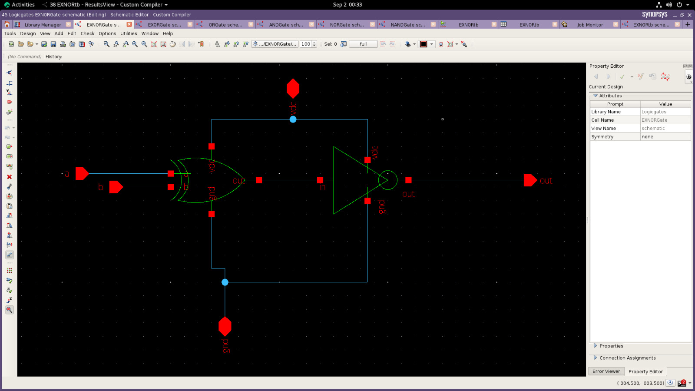

## Symbol

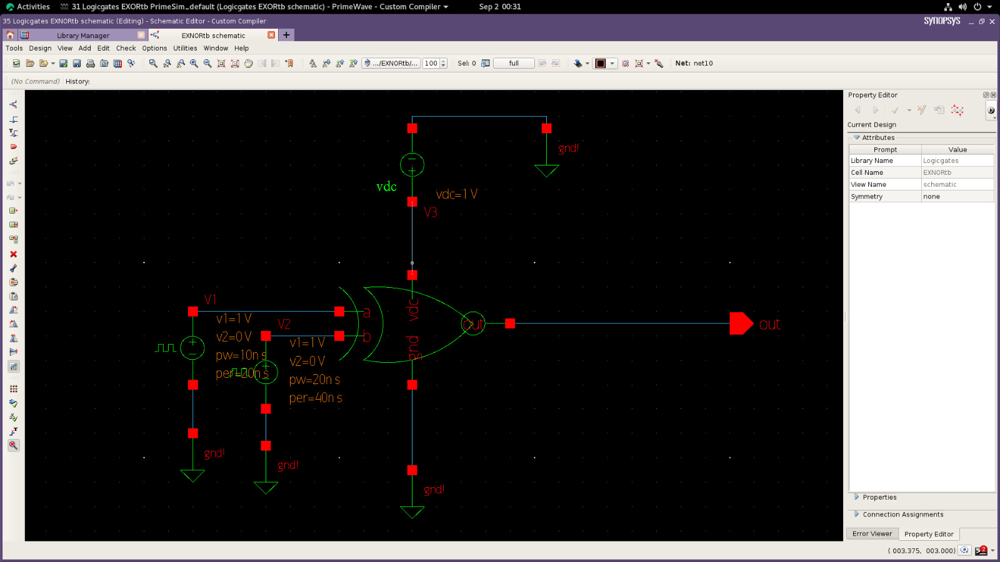

## Waveform

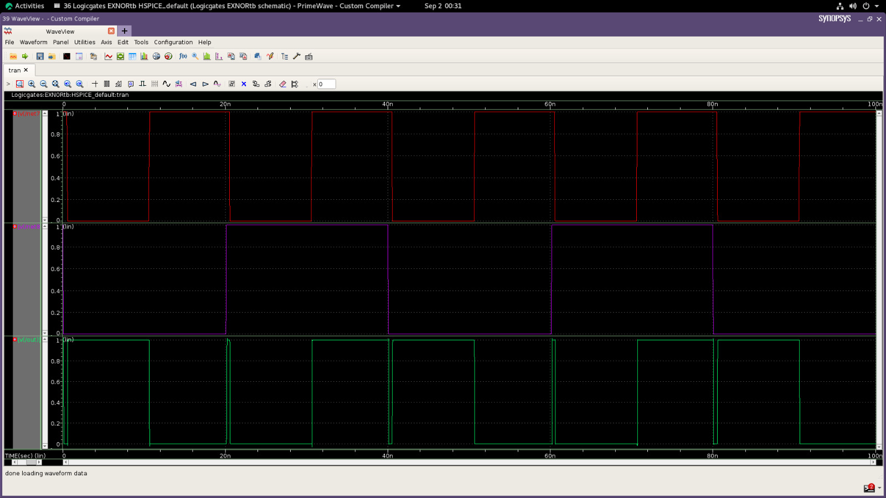

---

# Half Adder

## Schematic

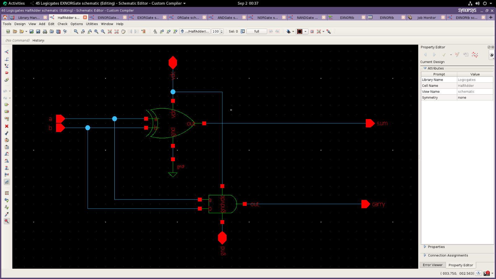

## Symbol

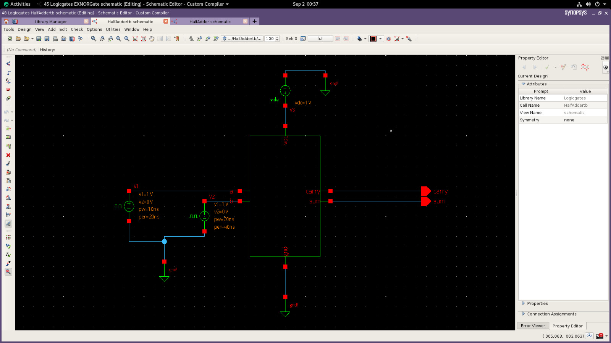

## Waveform

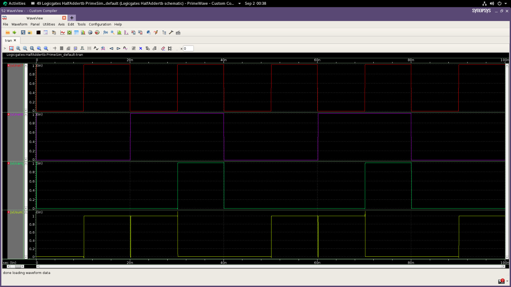

---

# Full Adder

## Schematic

## Symbol

## Waveform

---

# Author

Yogavelan M D
